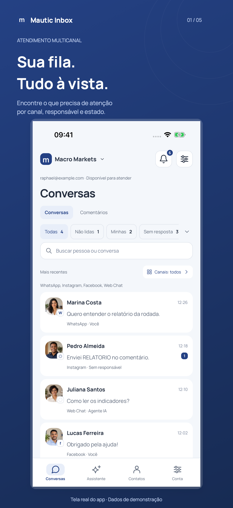
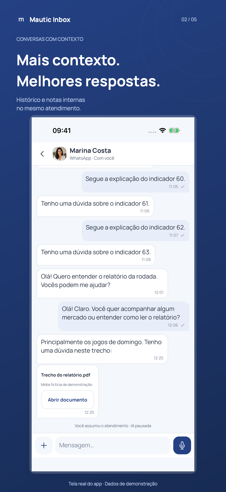
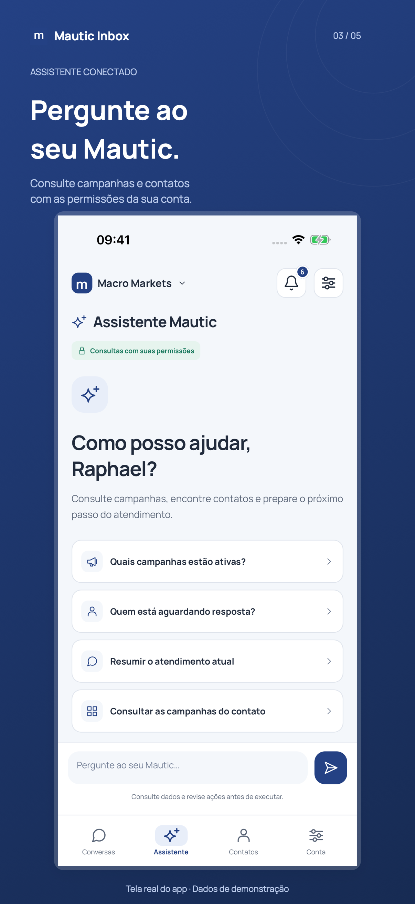
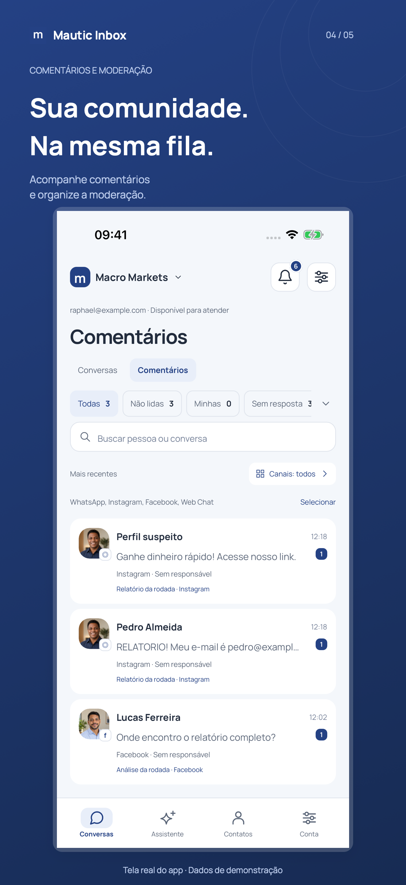
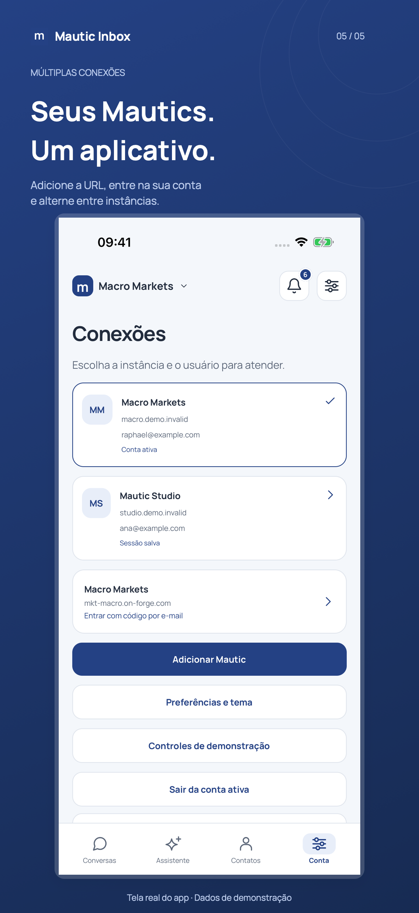

# Mautic Inbox

## Seu atendimento. Onde você estiver.

**Leve as conversas do seu Mautic para o celular.** Responda com o histórico à mão, acompanhe comentários e consulte campanhas e contatos com um assistente conectado à sua instalação.


Feito para equipes que atendem clientes e precisam acompanhar a fila mesmo longe do computador. No iPhone, no iPad e no Android, seu Mautic acompanha o seu trabalho.

**[Acompanhe o lançamento e as próximas versões](https://github.com/raphaelcangucu/mautic-inbox-mobile/releases)** · [Privacidade e suporte](https://mautic-inbox-privacidade-e-suporte.me-21d3.chatgpt.site/)

### Mais contexto para cada resposta

- **Veja o que precisa de atenção.** Reúna os canais conectados ao seu Mautic e filtre a fila por canal, responsável e estado. WhatsApp, Instagram, Facebook e WebChat entram no mesmo fluxo de atendimento.
- **Retome a conversa de onde parou.** Consulte o histórico, registre notas internas e use respostas prontas. Histórico local e rascunhos ajudam a continuar o trabalho entre telas.
- **Pergunte ao seu Mautic.** Consulte campanhas, contatos e informações da instalação pelo assistente, com as permissões da sua conta e consentimento para compartilhar dados com o provedor de IA.
- **Encontre a pessoa certa.** Busque contatos por nome, e-mail ou telefone. Combine segmentos e campanhas e abra uma conversa pelo WhatsApp QR quando houver telefone válido e conexão ativa.
- **Cuide também dos comentários.** Acompanhe Instagram e Facebook, marque spam e organize a moderação na fila. Bloquear um autor no atendimento não bloqueia seu perfil na rede social.
- **Alterne entre seus Mautics.** Adicione as URLs, autentique suas contas e mantenha as sessões separadas. Receba notificações enviadas pela instalação que você conectou.

### Conheça o aplicativo

<table>
  <tr>
    <td align="center" width="33%"><a href="docs/media/01-conversas.png"></a><br /><strong>Sua fila, à vista</strong></td>
    <td align="center" width="33%"><a href="docs/media/02-chat.png"></a><br /><strong>Responda com contexto</strong></td>
    <td align="center" width="33%"><a href="docs/media/03-assistente.png"></a><br /><strong>Consulte seu Mautic</strong></td>
  </tr>
</table>
<table>
  <tr>
    <td align="center" width="50%"><a href="docs/media/04-comentarios.png"></a><br /><strong>Acompanhe sua comunidade</strong></td>
    <td align="center" width="50%"><a href="docs/media/05-conexoes.png"></a><br /><strong>Vários Mautics, um app</strong></td>
  </tr>
</table>

*Imagens da interface nativa iOS com dados de demonstração. Toque nas imagens para ver os detalhes. Disponível em português, inglês e espanhol, com temas claro e escuro.*

### Prepare sua equipe para atender pelo celular

1. Tenha uma instalação Mautic com a [Inbox Mobile API compatível](https://github.com/raphaelcangucu/mautic-inbox-bundle).
2. Conecte a URL da instalação e entre com seu usuário autorizado.
3. Acompanhe a fila e atenda pelos canais habilitados para a sua conta.

O aplicativo é gratuito. Canais, assistente, moderação e notificações dependem da configuração da sua instalação e das permissões do usuário.

### Download nas lojas

| Plataforma | Disponibilidade pública |
| --- | --- |
| iPhone e iPad · App Store | Em breve — versão enviada e aguardando revisão da Apple. |
| Android · Google Play | Em breve — sem link público de download confirmado. |

Os links oficiais de download serão adicionados após a liberação nas lojas. Enquanto isso, **[acompanhe as versões no GitHub](https://github.com/raphaelcangucu/mautic-inbox-mobile/releases)** ou compile o código disponível neste repositório.

<details>
<summary><strong>Para desenvolvedores: instalação, build e publicação</strong></summary>

## Install and verify

Use Node.js 22.22.2 or compatible, Python 3.10+, and Ruby with Bundler for Fastlane. Native iOS builds require macOS/Xcode/CocoaPods. Android builds require Android SDK 36 and Java 17+.

```sh
npm ci --include=dev
npm run typecheck
npm test
python3 -m unittest discover -s scripts/tests -p 'test_*.py'
bundle install
bundle exec ruby fastlane/tests/review_draft_test.rb
bundle exec ruby fastlane/tests/listing_guard_test.rb
```

## Native builds

`ios/` and `android/` are generated from `app.json`, `app.config.cjs` and `plugins/`; generated projects are deliberately untracked. Icon, fonts and sample media under `assets/` are referenced by the app and required to build.

```sh
npm run ios
npm run android
# Release simulator/device archive without distribution signing
npm run build:ios
# Local Android APK (not a Play-signed distribution)
npm run build:apk
```

The build scripts create isolated temporary workspaces and keep outputs in ignored `artifacts/`. JavaScript bundles can be verified without signing via `npx expo export --platform ios --platform android`.

## Signed release with Fastlane

```sh
bundle exec fastlane ios archive
bundle exec fastlane ios internal_testflight
bundle exec fastlane android bundle
```

Provide private credentials through environment variables listed in `.env.example`, with their actual files outside the repository and owner-only permissions. iOS also requires an existing distribution certificate/profile in the local signing environment. APNs provider keys stay on the Mautic server; they never belong in the app. Existing app identifiers and build numbers are preserved. Increase build numbers before a new store binary upload.

Publication metadata, localized headlines and asset-generation scripts are versioned. Screenshots, evidence, videos, signed binaries and review-account instructions are generated or supplied locally and are not committed. Store-upload gates fail until current-build captures and visual/physical validation are supplied; cloning this repository does not invent release approval.

For subsequent listing updates, see [the asset publication workflow](docs/ASSETS-PUBLICACAO-PROXIMAS-VERSOES.md). `ios store_listing` cannot overwrite a version under active Apple review. Submission remains a separate action.

## Repository scope

This repository contains app source, runtime assets, pinned dependency lockfiles, unit tests, build/release tooling and public listing text. Local review environments, internal QA history, cached dependencies and generated native projects are excluded. Never commit credentials, signing keys, authentication tokens, customer data or release binaries.

</details>
